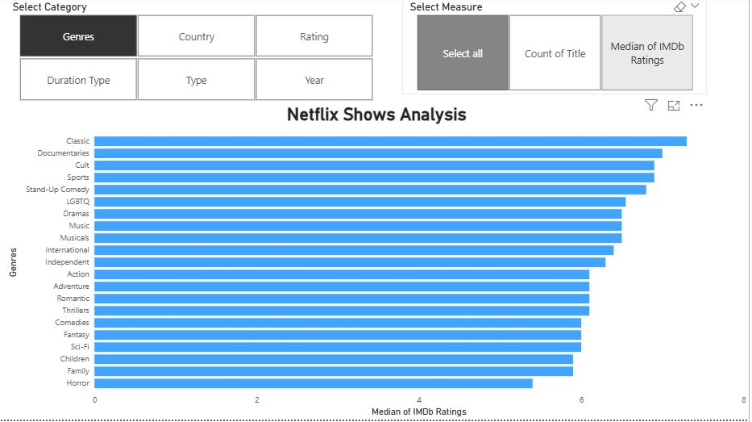
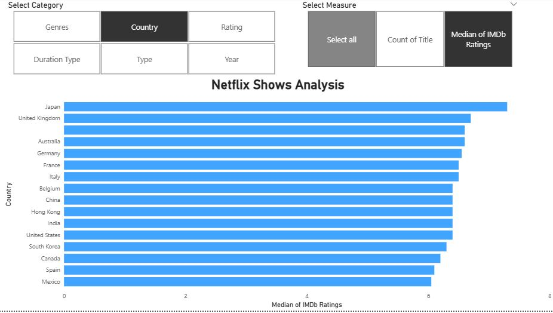
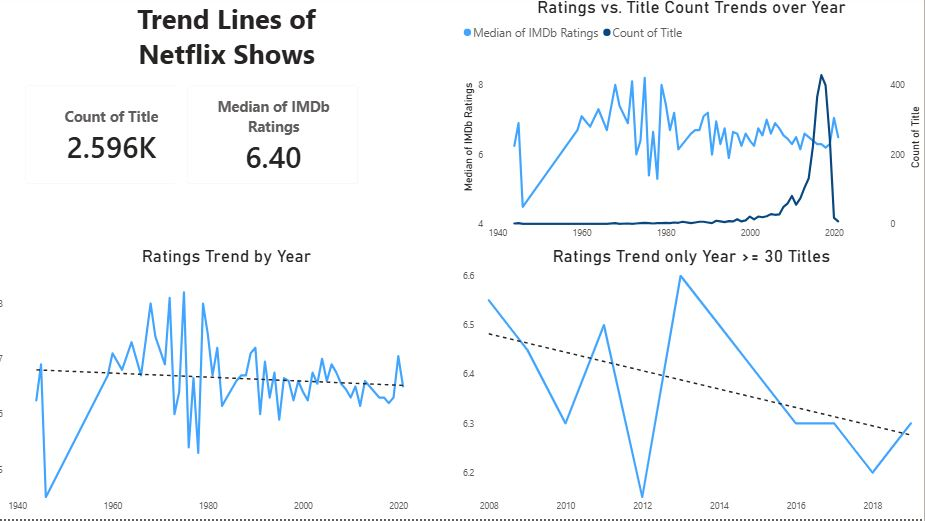

# Netflix Shows Analysis
## Introduction
Netflix Shows Analysis contains an exploration of Netflix titles, including both movies and TV shows. The dataset covers 2,596 Netflix titles released between 1944 and 2021. The median IMDb rating is 6.40. The analysis examines ratings trend over the years and the differences of genres, country, rating, duration type, shows type, and released years in relation to ratings and count of titles. 
### Resources
- Netflix Titles Dataset from [Kaggle](https://www.kaggle.com/datasets/shivamb/netflix-shows)
- IMDb Netflix Shows Rating from [Kaggle](https://www.kaggle.com/datasets/sukhmandeepsinghbrar/netflix-all-movie-ratings-by-imdb)
### Tools and Features
- Power BI
    - **Field Parameters**: Allow dynamic selection of categories and measures in visuals.
    - **Slicers**: Enable interactive filtering by genre, country, release year, and show type.
    - **Dual-axis Line Chart**: Used to compare ratings trend vs. title count trend.
    - **Bar Charts with Parameters**: Show median IMDb ratings by genre and country with dynamic selection.
    - **Data Transformation (Power Query)**: Cleaned and standardized dataset before visualization.
    - **Calculated Columns & Measures (DAX)**: Created median ratings, title counts, and trend calculations.

### Results
Here are some highlights from Power BI dashboard:

Due to disparate data, figure 1 and 2 only include data with at least 30 Netflix titles. This ensures that the median values are representative of the dataset.

#### **Figure 1**

This visual allow you to select category and measure in the parameter fields. The bar chart above shows that the genre with the high median IMDb ratings is classic.

#### **Figure 2**

Here another bar chart you could select from the parameter fields. The country with the highest median IMDb ratings is Japan.

#### **Figure 3**

There are trend lines of Netflix Shows over years:
- **Ratings trend** shows slight variation.
- And when filtering only **30 titles**, the variation becomes clearly visible.
- Finally, the **ratings vs. title count trend** suggests that ratings tend to be slightly lower when the number of titles is higher.

For the full interactive dashboard, check the **project_netflix.pbix** file attached.